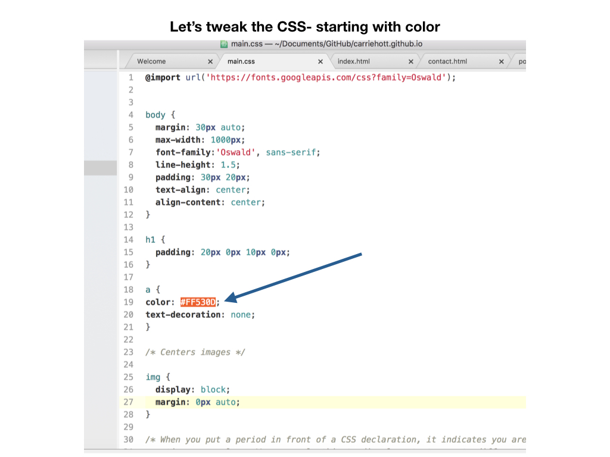
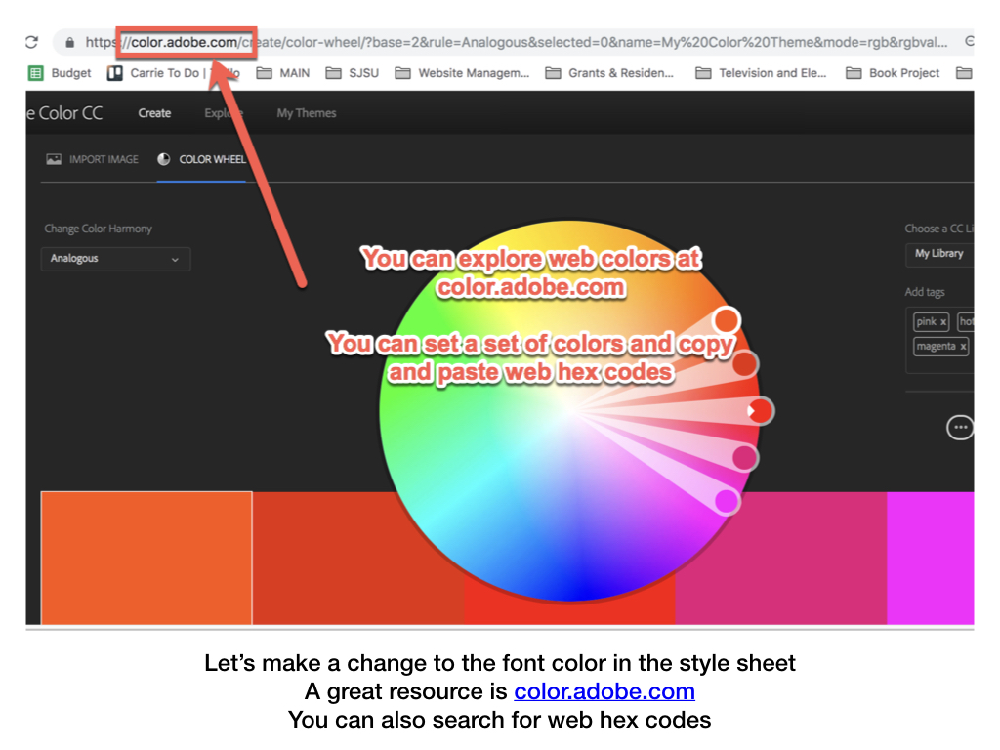
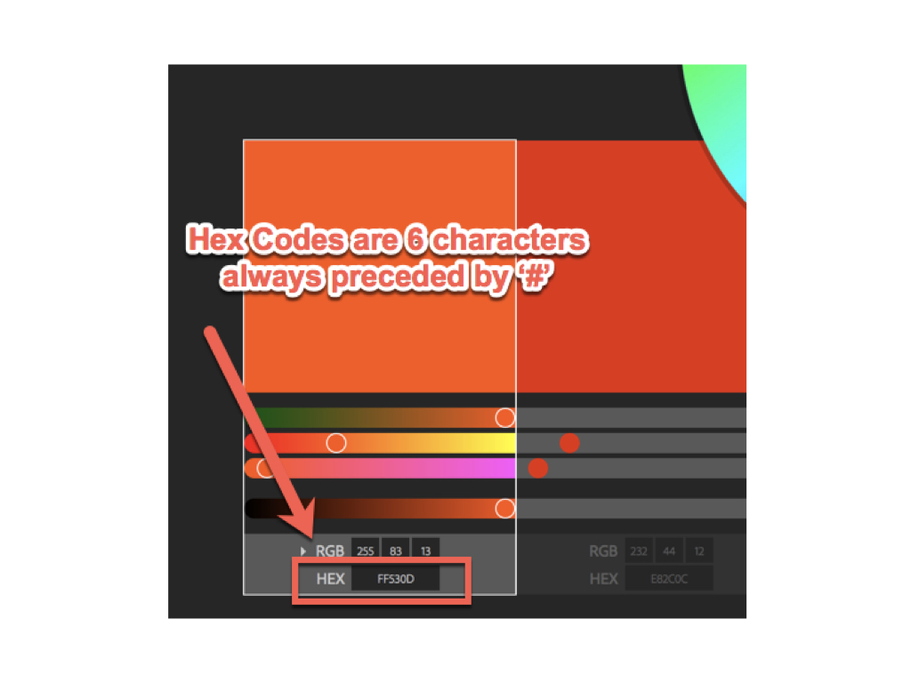
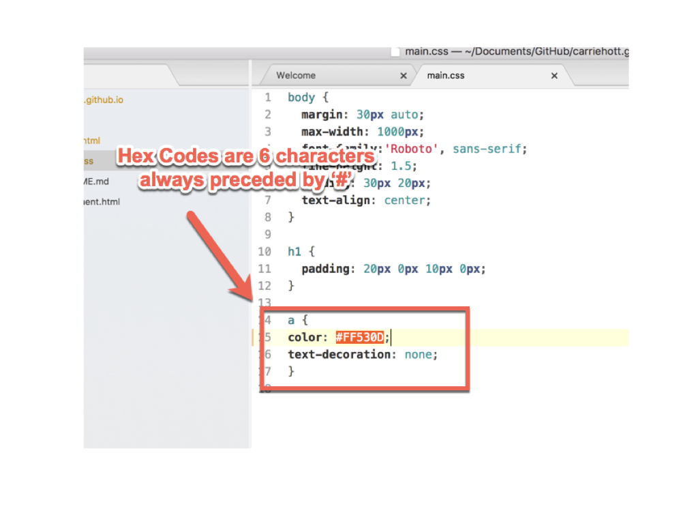
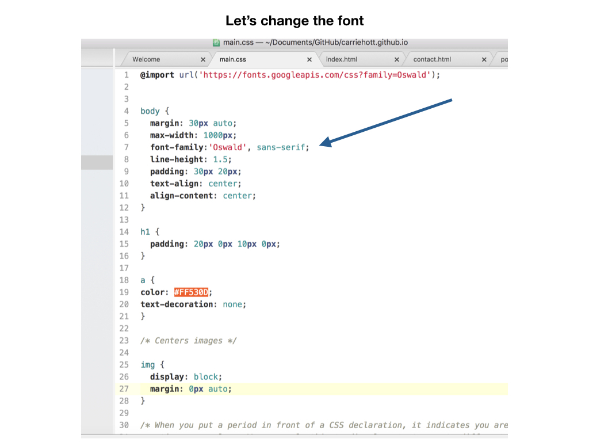
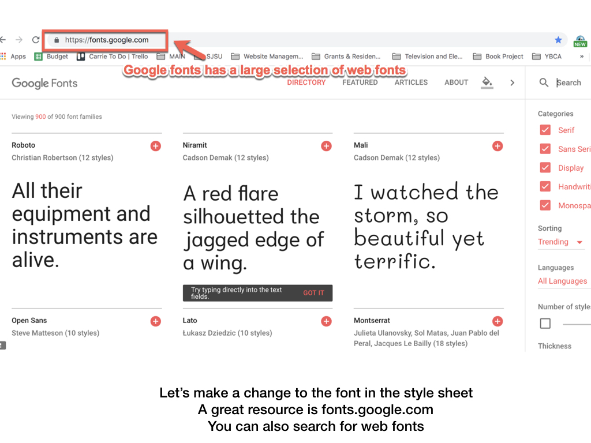
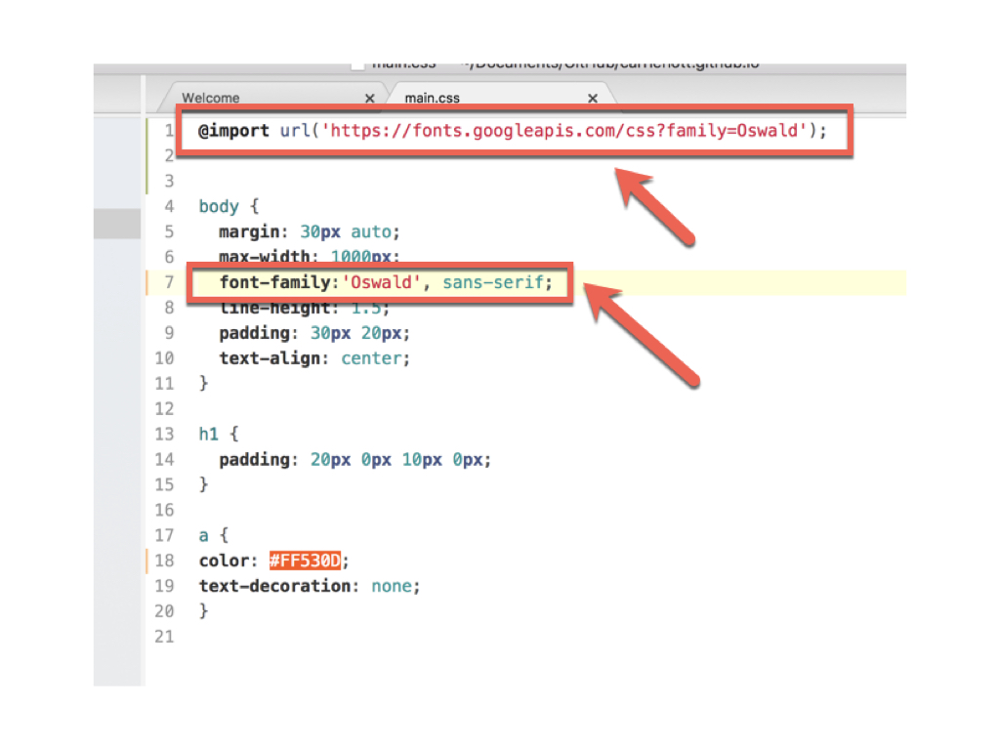

# **PORTFOLIO WEBSITE STYLING GUIDE**

#### **On this page:**
1. [What Is This Page For?](#what-is-this-page-for)
2. [Adjusting Color and Hex Codes](#adjusting-color-and-hex-codes)
3. [Adjusting Fonts](#adjusting-fonts)
4. [Change Link Hover Color](#change-link-color-and-hover-color)
5. [Horizontal Navigation Menu](#horizontal-navigation-menu)
6. [Background Image or Color](#background-image-or-color)
7. [Custom Domains](#custom-domain)
8. [Search Engine Optimization](#search-engine-optimization)

# What is this page for
This page provides basic steps to further style your portfolio website beyond the basic setup. **It is up to you whether you continue with these additions- it is not required.** You can use what you would like. Art websites are as individual as artwork, so it is up to you how your website looks. However, there are some basic functions here you may find useful. If you are looking for a guide to a layout that is not here, check the resources section on the [HTML/CSS page](https://carriehott.github.io/SJSU_Art74/tutorials/HTML_CSS/) for other places to find styling code.

# Adjusting Color and Hex Codes
### **Open your main.css page if it is not yet. We are going to make _minor_ adjustments. Reminder: Be Careful and move slowly in CSS!**

### The default style for a link is underlined and dark blue/purple. Because it's hard to read on my background, I might change that to a lighter blue in my CSS, and set text-decoration to none.

### You can make changes to all anchor tags (links) at once by using the CSS selector 'a' .  Copy this rule below your 'h1' rule and above your 'img' rule.
 
 

    a {
    color: #69CBBB;
    text-decoration: none;
    }

# Adjusting Fonts

# Change Link Hover Color
You can add more style to your links and change the color on hover (when they are moused over), by adding more link 'a' selectors to your stylesheet.  For more link styling options- [check out this page.](https://www.w3schools.com/css/css_link.asp)

#### **Code to copy to your CSS document below your first 'a' selector:**

    /* mouse over link */
      a:hover {
          color: hotpink;
        }

### Your stylesheet should look like this:

# Horizontal Navigation Menu
### Right now your navigation menu at the top of each page is a stack of links. If you would like to line up the links on one line (see example below), follow these steps:

### First, on each of our html pages with menus, we need to turn our header into a div and add list tags to our menus. The new code looks like this:

#### **Code to copy to your HTML documents over existing header menus:**

    

    <a href="index.html"><h1>Your Name</h1></a>
    <ul>
    <li><h3><a href="portfolio.html">Portfolio</a></h3></li>
    <li><h3><a href="statement.html">Artist Statement</a></h3></li>
    <li><h3><a href="contact.html">Contact</a></h3></li>
    </ul>
    

#### **Code to copy to your CSS page over existing header menus below the a:hover selector and above the img selector:**

    /* Style the header div */
      .header {
          padding: 30px;
          text-align: center;
          font-size: 25px;
        }

        .header ul {
      	   display: flex;
           justify-content: center;
         }

         .header ul li {
    	      list-style-type:none;
    	      display: list-item;
    	      line-height: 10px;
            padding: 10px 30px 30px 0px;
          }

### Your CSS page should look like this:

 
 

### Preview your page to see your new menu!

 

# Background Image or Color
### To create a full background image for your  website on every page, copy the code below in your CSS (see the screenshot for instructions).

#### **Code to copy to your document below your first body selector:**

    body {
      background-image: url(images/YourBackground.jpg);
      background-repeat: no-repeat;
      background-size: cover;
    }

### IF you want to have a different background image on every page of your site, then you need to add the code to your individual HTML pages.

#### **When you add CSS code to an individual HTML page, it goes in the <head></head> section, under the < title > and link to the stylesheet. YOU MUST add < style > style tags around the code </ style >.**

For more options, [see this page on W3Schools.](https://www.w3schools.com/cssref/pr_background-image.asp)

## Background Color
### To create a full background color for your  website, try the code below in your CSS.

For more options, [see this page on W3Schools.](https://www.w3schools.com/cssref/pr_background-color.asp)

#### **Code to copy to your document below your first body selector:**

    body {
      background-color: coral;
    }

# Custom domains

You can purchase a custom domain from a domain name registrar. GoDaddy and NameCheap are two popular sites.

Once you have purchased your custom domain, connect the domain to your GitHub page. This way, whenever someone goes to www.yourName.com, your GitHub page will load.

* [General tutorial from GitHub help](https://help.github.com/articles/quick-start-setting-up-a-custom-domain/)
* [Tutorial specific to GoDaddy domains](https://medium.com/@LovettLovett/github-pages-godaddy-f0318c2f25a)
* [Tutorial specific to NameCheap domains](http://davidensinger.com/2013/03/setting-the-dns-for-github-pages-on-namecheap/)

# Search Engine Optimization

How are websites found by search engines? AKA how does Google list my website when people google me?

Search engines like Google scan the internet with bots to index all the websites and determine which ones show up in your search results.

So you want to make sure you give them the right descriptions and keywords!

In addition to the <title> tag, which shows up in the browser tab, you can also add a description and keywords. Insert this code into your HTML header, and read over this [PDF on how to optimize your HTML tags for bots](http://www.theinternetofbots.com/pdf/Search%20Engine%20Optimization%20-%20The%20Internet%20of%20Bots.pdf).

    <meta name="description" content="description in 50–300 characters (letters).">
    <meta name="keywords" content="artist, your name, your nick name, digital media art, all the keywords">

 

